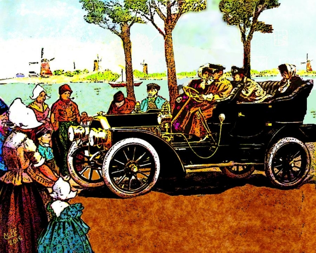

# Rideshare Car Problem



## Problem Description

#### Autonomous Vehicle Routing

You are the proud owner of a ride-sharing service, consisting of a single vehicle that can travel within a city. Prospective passengers can use an app to summon the vehicle to pick them and take them where they need to go. Your challenge is to come up with an efficient routing system that chooses the order in which to pick and drop off passengers, getting everyone to their destinations in a reasonable amount of time.

Some constraints:
* The city is a grid of equal-size square blocks. On initialization, the code will take the dimensions of this grid.
* The vehicle can move in any direction exactly one block per unit of time. We only care when the vehicle is at the point of intersection between two streets, e.g. (0,0), the upper-left, or (9,9), the lower-right.

There should be a function to advance time by one time-unit (and hence the vehicle by one block in any direction). This function should also accept a list of ride requests. These come in the form of JSON requests, such as:

```json5
{ requests: [
    {
      'name': 'Fred',
      'start': [3,4],
      'end': [7,7]
    },
    {
      'name': 'Wilma',
      'start': [1,2],
      'end': [5,4]
    }
  ]
}
```

At each time step, this list of requests can be an empty list, or infinitely long. At each time step you should print out the current position of the vehicle and the names of the passengers currently in the vehicle, as well as anybody dropped off or being picked up at this intersection. Assume that the vehicle can hold any number of people.

Your goal is to schedule the vehicle to get people where they want to go as fast as possible. Of course, you will likely have to make some trade-offs in the process. There is no perfect right answer, but your reasoning should be clearly explained.

For this problem, C++ is the target language.

## Process

I decided to write my initial prototypes in Python, because it's easier to hack stuff together in that language than in C++.

## First Pass

`CarProblem.py`

I first considered the problem as a version of the Traveling Salesman Problem. I generated a random list of points (within the grid space), then searched for the most efficient path through them. This was a process of recursively exploring a search tree, but constraining the search to reduce the number of branches generated at each node (i.e. only the closest unvisited points are considered as a next step). I'd also abort the recursion if the distance traveled had surpassed the best route found so far.

#### Sample Output

The letters indicate the order in which points are visited.
```
(0,0)-(0,3)-(6,5)-(2,10)-(1,11)-(0,14)-(3,19)-(4,14)-(7,14)-(11,16)-(14,15)-(15,12)-(10,10)-(12,5)-(12,4)-(19,3) 80
a . . . . . . . . . . . . . . . . . . .
. . . . . . . . . . . . . . . . . . . .
. . . . . . . . . . . . . . . . . . . .
b . . . . . . . . . . . . . . . . . . p
. . . . . . . . . . . . o . . . . . . .
. . . . . . c . . . . . n . . . . . . .
. . . . . . . . . . . . . . . . . . . .
. . . . . . . . . . . . . . . . . . . .
. . . . . . . . . . . . . . . . . . . .
. . . . . . . . . . . . . . . . . . . .
. . d . . . . . . . m . . . . . . . . .
. e . . . . . . . . . . . . . . . . . .
. . . . . . . . . . . . . . . l . . . .
. . . . . . . . . . . . . . . . . . . .
f . . . h . . i . . . . . . . . . . . .
. . . . . . . . . . . . . . k . . . . .
. . . . . . . . . . . j . . . . . . . .
. . . . . . . . . . . . . . . . . . . .
. . . . . . . . . . . . . . . . . . . .
. . . g . . . . . . . . . . . . . . . .

(venv) D:\CodingProjects\Python\CarProblem>
```

#### Disadvantages

This isn't the fastest solution when there are a LOT of points to cover, although I'm sure performance in C++ would have been satisfactory. Also, I'd made no distinction between pick-up and drop-off points, and anticipated that that requirement would make the recursive function more complicated.

Then there's the issue that, realistically, passengers would expect the car to try to prioritize earlier requests over later ones. An efficient route planner doesn't take that into account. It's easy to imagine a situation where someone on a long trip keeps being diverted as local requests pop up.

Finally, this felt like too old-school of an algorithm, effective for a rigid set of requirements, but not very flexible or adaptable.

## Second Pass

`CarProblem2.py`

I thought about the problem in terms of maximizing passenger happiness (or, really, minimizing *unhappiness*). A passenger who is waiting for a ride has an expectation of being picked up within a certain amount of time after they summon the car. If that threshold is surpassed, the passenger grows more and more unhappy.

Similarly, once a passenger boards the car, they have a hope that the journey will take a certain amount of time, and they grow unhappier the more time they spend in the car beyond that amount. Fortunately, passengers who anticipated a longer trip are more tolerant of delay (in absolute terms) than passengers who expected a shorter trip. Naturally, a person going across town to the airport will add more cushion time to their plans than a person going to a nearby bar.

In more formal terms, a passenger in transit is assigned an ideal pickup time and an ideal journey time. Both assume that the car takes the best possible route with no delays. Unhappiness is calculated by dividing elapsed time (or predicted elapsed time) by ideal time, then applying a bias factor (which assumes that a passenger never expects the actual time to match the ideal time). Without a bias, an unhappiness score for a journey that's double ideal time would be 2.0.

The car chooses its next passenger to pick up or drop off by predicting how much unhappiness a given choice will bring to ALL of the active passengers (including those waiting for a ride). The goal is to minimize overall unhappiness within the system. Because of the predictive factor, looking forward to when and where the car will be after arriving at a certain destination, the planning system is discouraged from wandering too far away from nearby pick-up or drop-off points, especially those with a higher level of urgency.

On each step, the Python program prints out a map of the city. It also prints out statistics on the systemic unhappiness that will be caused by selecting each active passenger as the next choice. The one with the lowest systemic happiness score is the best choice.

The program also keeps statistics about the average passenger unhappiness and journey time. I tried different ideas, seeking to minimize these over the course of hundreds of time steps. I also noticed that if I hold down the "Enter" key, the flipbook animation that results shows the car making what generally look like sensible moves. It reminded me, pleasingly, of the [last ASCII-based action game](https://www.youtube.com/watch?v=sj8SjoMIeOU) I'd played.

#### Sample Output

Here, the car (a "*") has just arrived where Passenger D is. It would bring about the least systemic unhappiness to pick up passenger D, followed by Passenger E and B, then dropping off Passenger I.

Dropping off A is the least good choice right now

```
Time step: 155
.   .   .   .   .   .   .   .   a   .
.   .   .   .   .   .   h   .   .   .
J   .   .   .   .   .   .   .   .   .
.   .   .   .   .   .   .   .   .   .
.   .   .   .   .   .   .   .   .   .
.   E   .   .   .   .   .   .   .   .
.   .   D*  .   .   .   .   .   .   .
.   .   .   .   .   .   .   .   .   .
i   .   .   .   .   .   .   .   .   .
.   B   .   .   .   .   .   .   .   .
Passenger D: unhappiness prediction 5.00, system unhappiness 41.72
Passenger E: unhappiness prediction 3.67, system unhappiness 47.00
Passenger B: unhappiness prediction 4.33, system unhappiness 49.30
Passenger I: unhappiness prediction 14.80, system unhappiness 49.60
Passenger J: unhappiness prediction 3.83, system unhappiness 60.02
Passenger H: unhappiness prediction 2.25, system unhappiness 71.02
Passenger A: unhappiness prediction 7.83, system unhappiness 81.87
```

#### Advantages

This solution performs reasonably well. It seems easy to add improvements such as:

* Multiple cars
* Limiting passengers per car
* Better look-ahead, i.e. instead of seeing what systemic happiness will be if we look one pickup/dropoff ahead, we look two or three.
* A factor to make idealized passengers more patient (less quick to become unhappy) at times when there's more demand for the car.

## Third Pass

Next, I coded my Second Pass solution in C++, reorganizing the class structure and adding more safety features, such as exception throwing and use of const.

The parts of the framework are:

Class | Purpose
------|--------
Point | a coordinate in city space
Car   | the car
PassengerData | represents a known passenger, e.g. George
Passenger | a passenger currently in transit
Dispatcher | implements actual heuristic, manages PassengerData, Passenger, Car objects
RideShareTester | performs a series of simulations

#### Test Designs

Most of the tests are run by loading a JSON file, then triggering the specified requests (if any) at each time step of the simulation.

Some JSONs contain malformed data and these tests are expected to throw exceptions. The JSONs can be found in the `\data` folder.

There are also several randomly-generated tests. It's pretty straightforward, from looking at the code, how the tests work.

#### JSON processing

I used some Python libraries to generate sample JSONs. On the C++ side, I took advantage of this free library: https://github.com/nlohmann/json

#### Running

I wrote this code in Visual Studio 2019 and have provided the necessary solution and project files. Nothing special has to be done to get the JSON library to work, since it's just a header file. Some of the file system stuff relies on ISO C++ 17.

I ran out of time and didn't try to make it work for Linux, but I'm sure I could, if requested. I may (or may not) have to modify how the handing of file paths in `RideShareTester.cpp/h` works

#### Sample Output

```Current passengers: Aloysius, Hildebrand
Time step: 462, car at: (0,2)
Current passengers: Aloysius, Hildebrand
Time step: 463, car at: (0,1)
Current passengers: Aloysius, Hildebrand
Pickups: Ivanka
Time step: 464, car at: (1,1)
Current passengers: Aloysius, Hildebrand, Ivanka
Time step: 465, car at: (2,1)
Current passengers: Aloysius, Hildebrand, Ivanka
Time step: 466, car at: (3,1)
Current passengers: Aloysius, Hildebrand, Ivanka
Time step: 467, car at: (4,1)
Current passengers: Aloysius, Hildebrand, Ivanka
Pickups: Georgia
Time step: 468, car at: (3,1)
Current passengers: Aloysius, Hildebrand, Georgia, Ivanka
Time step: 469, car at: (2,1)
Current passengers: Aloysius, Hildebrand, Georgia, Ivanka
Time step: 470, car at: (1,1)
Current passengers: Aloysius, Hildebrand, Georgia, Ivanka
Time step: 471, car at: (1,2)
Current passengers: Aloysius, Hildebrand, Georgia, Ivanka
Time step: 472, car at: (1,3)
Current passengers: Aloysius, Hildebrand, Georgia, Ivanka
Dropoffs: Georgia
Time step: 473, car at: (2,3)
Current passengers: Aloysius, Hildebrand, Ivanka
Time step: 474, car at: (3,3)
Current passengers: Aloysius, Hildebrand, Ivanka
Time step: 475, car at: (4,3)
Current passengers: Aloysius, Hildebrand, Ivanka
Time step: 476, car at: (5,3)
Current passengers: Aloysius, Hildebrand, Ivanka
Time step: 477, car at: (6,3)
Current passengers: Aloysius, Hildebrand, Ivanka
Time step: 478, car at: (7,3)
Current passengers: Aloysius, Hildebrand, Ivanka
Pickups: Dumbledore
Time step: 479, car at: (8,3)
Current passengers: Aloysius, Hildebrand, Ivanka, Dumbledore
Dropoffs: Dumbledore
Time step: 480, car at: (8,4)
Current passengers: Aloysius, Hildebrand, Ivanka
Time step: 481, car at: (8,5)
Current passengers: Aloysius, Hildebrand, Ivanka
Time step: 482, car at: (8,6)
Current passengers: Aloysius, Hildebrand, Ivanka
Dropoffs: Aloysius
```

... snipped ...

```
JSON test complete for RideRequests1.json
Total trips: 74, average unhappiness: 1.202728, average trip time: 35.108112
----------------------------
Test RideRequests1.json succeeded as expected.
Info: None

Running test: RideRequestsDoubleRequest.json
----------------------------
JSON path is: "D:\\CodingProjects\\CPP\\CarProblem\\CarProblem\\data\\RideRequestsDoubleRequest.json"
Time step: 0, car at: (0,0)
Current passengers: None
Time step: 1, car at: (1,0)
Current passengers: None
Time step: 2, car at: (2,0)
Current passengers: None
Pickups: Betty
----------------------------
Test RideRequestsDoubleRequest.json failed as expected.
Info: Active passenger 2 already exists
```

... snipped ...
